# Proceso de Preparación y Análisis de Datos

**Elaborado por:** Tomás González y Sebastián Salamanca  
**Sección:** BIY7131-001D  
**Profesor:** Fernando Esteban Fuentes Gallegos  
**Evaluación Parcial 2**

---

## Paso 1: Creación del Bucket

Se crea el bucket con el nombre correspondiente al formato “nombre-alumno”, cumpliendo con las indicaciones del entorno de almacenamiento.

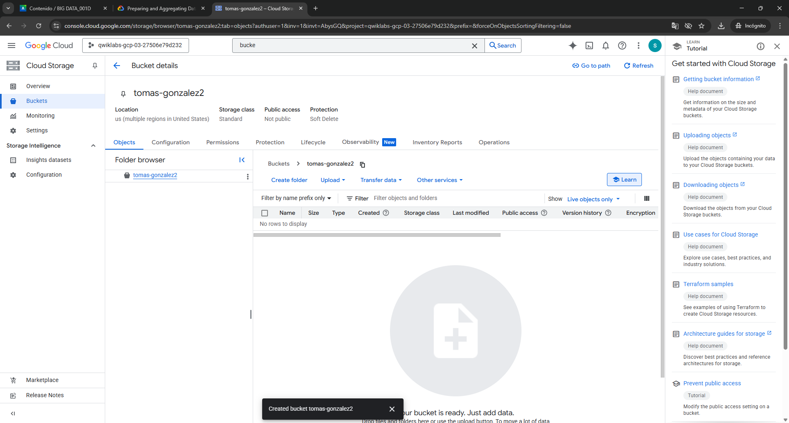

---

## Paso 2: Carga del Excel

Se sube al bucket el archivo Excel que contiene los registros en bruto de los avistamientos para su procesamiento.

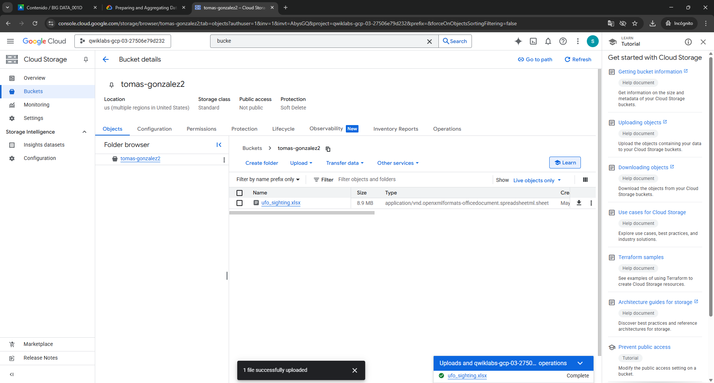

---

## Paso 3: Carga a Alteryx (Dataprep)

Se importa el archivo Excel a la herramienta Alteryx (Dataprep by Trifacta) para iniciar la preparación de los datos.

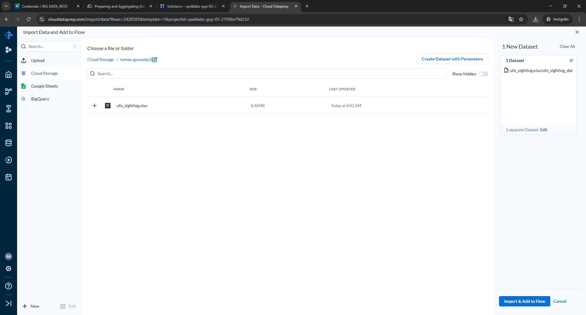

---

## Paso 4: Integración al Flow

El Excel es vinculado a un flujo de trabajo (flow) para su análisis dentro de la plataforma.

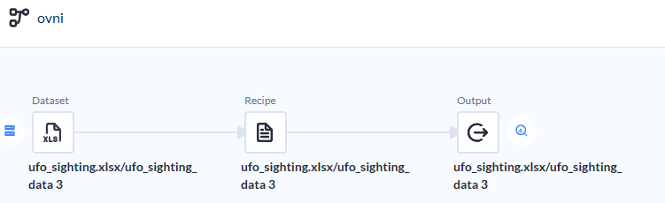

---

## Paso 5: Visualización de Datos en Bruto

Se revisa el contenido original del archivo para identificar los campos disponibles y su estado.

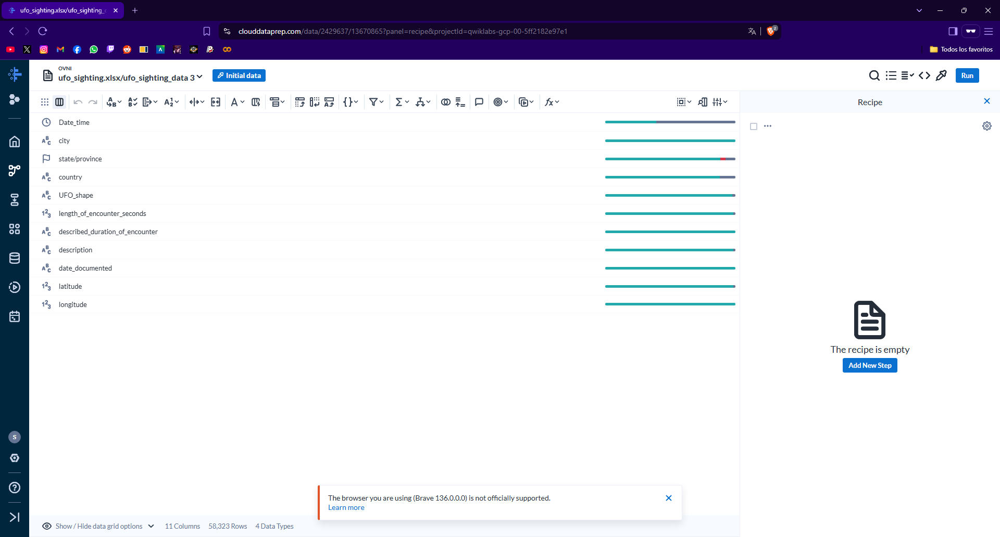

---

## Paso 6: Transformaciones en la Recipe

Se aplican transformaciones visibles en la receta (recipe), como limpieza de datos, renombre de columnas y filtrado de campos.

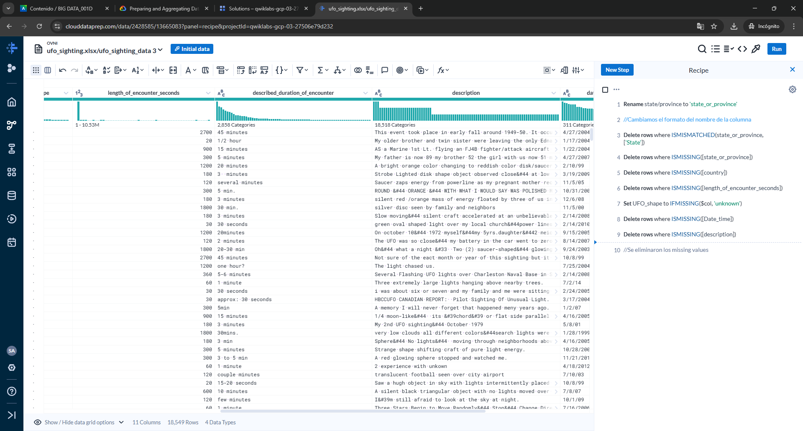

---

## Paso 7: Datos Transformados

Se muestran los datos ya transformados y preparados para su análisis, listos para su uso.

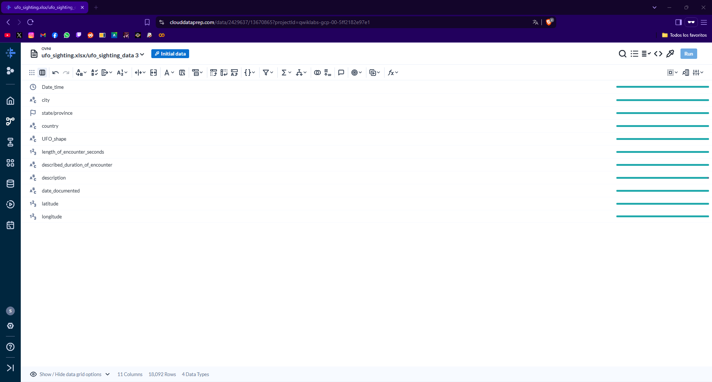

---

## Paso 8: Creación del Job

Se ejecuta el job de exportación para generar una tabla con los datos tratados en BigQuery.

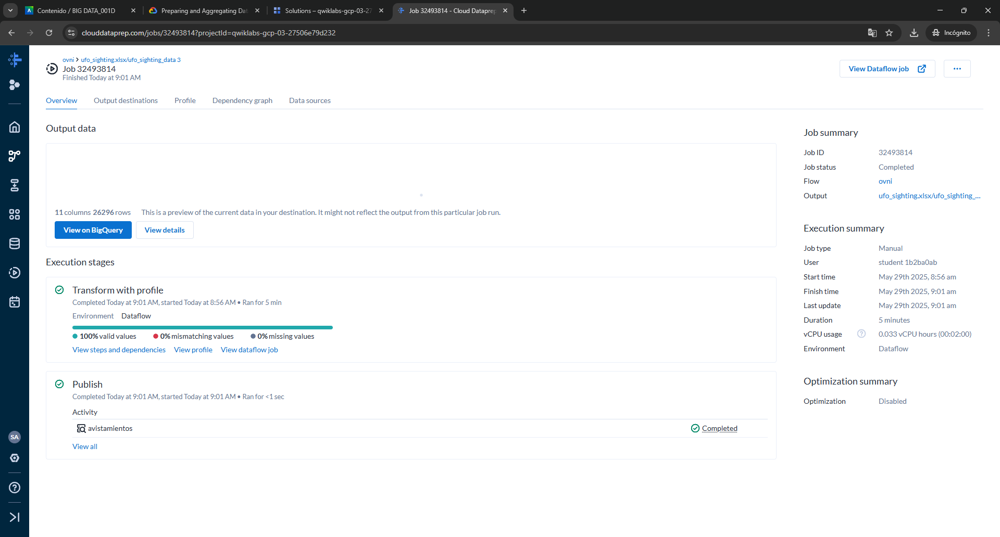

---

## Paso 9: Tabla en BigQuery

Validación de que la tabla fue correctamente creada en el entorno de BigQuery con los datos procesados.

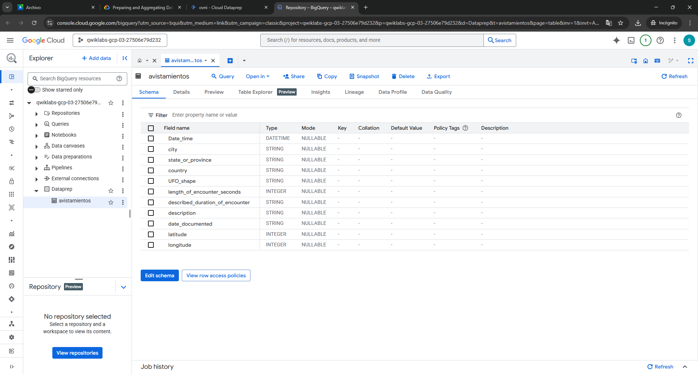

---

## Paso 10: Consulta SQL

Se formula una consulta SQL para extraer las 5 formas de objetos más reportadas en los registros de avistamientos.

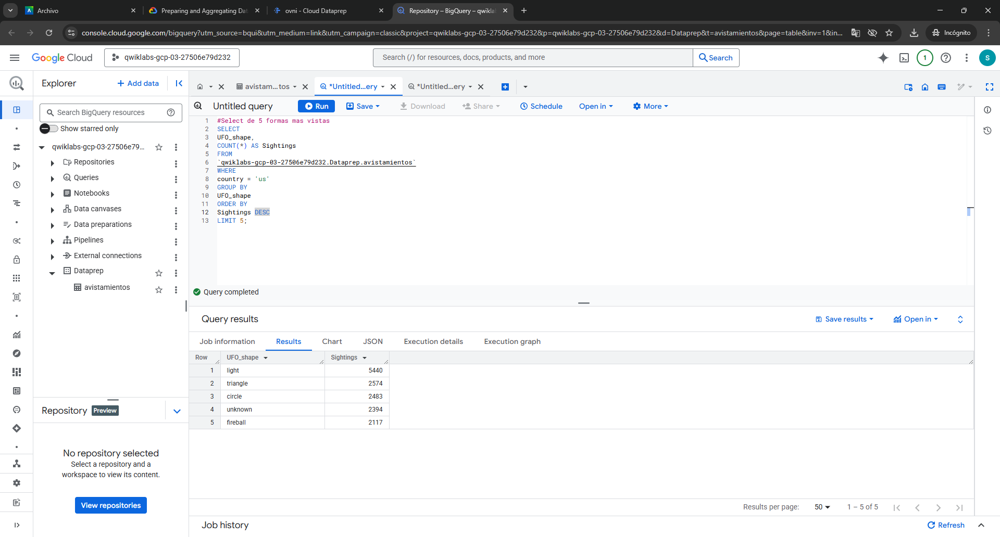

---

## Paso 11: Resultados de Consulta

Resultados obtenidos de la consulta, ordenados por frecuencia, lo que permite interpretar los datos más relevantes.

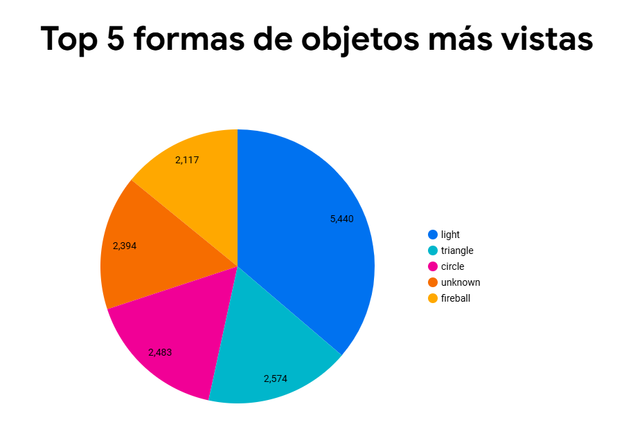

---

## Paso 12: Consulta SQL para Análisis Cantidad de avistamiento por año

Resultados de cantidad de avistamientos por año de forma descendente.

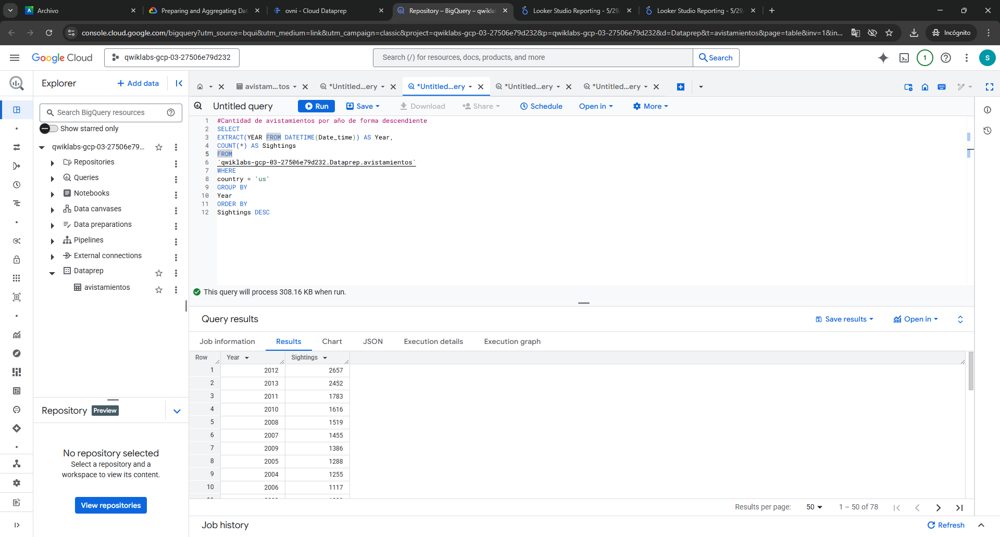

---

## Paso 13: Visualización Gráfica

Gráfico generado a partir de los datos procesados, evidenciando visualmente las principales formas reportadas.

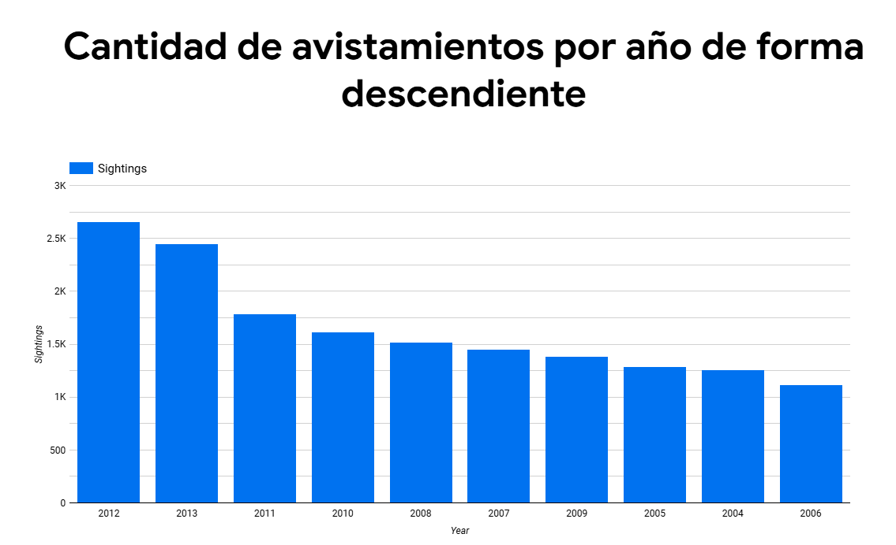

---

## Paso 14: Visualización y Análisis

Con base en la consulta anterior, se genera una visualización que muestra el Top 10 de estados con más avistamientos. Este gráfico permite identificar que estados como California, Washington y Florida presentan una alta concentración de fenómenos reportados, lo que podría estar relacionado con la densidad poblacional o la cobertura tecnológica en esas áreas.

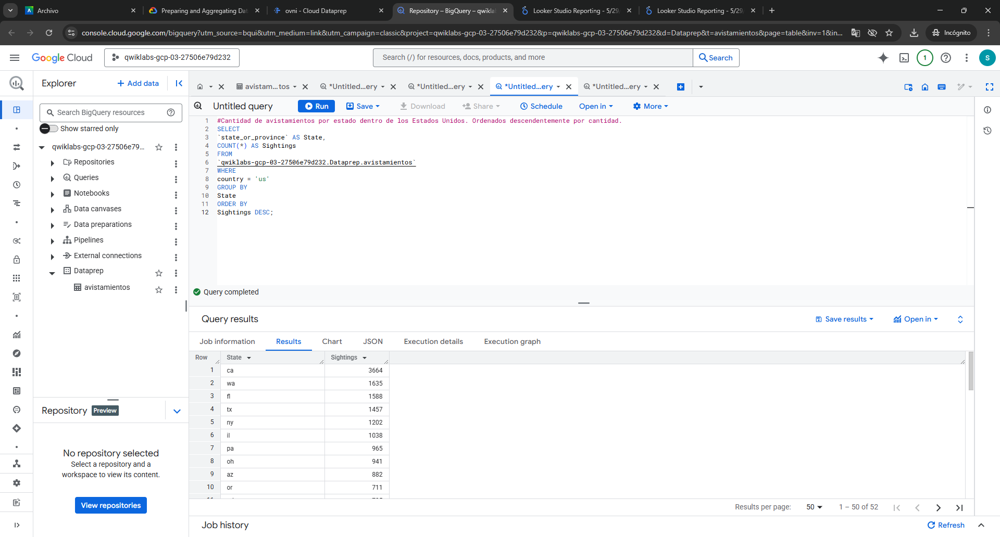

---

## Paso 15: Visualización

En el gráfico se puede visualizar la cantidad de avistamientos por estados dentro de Estados Unidos de forma descendente.

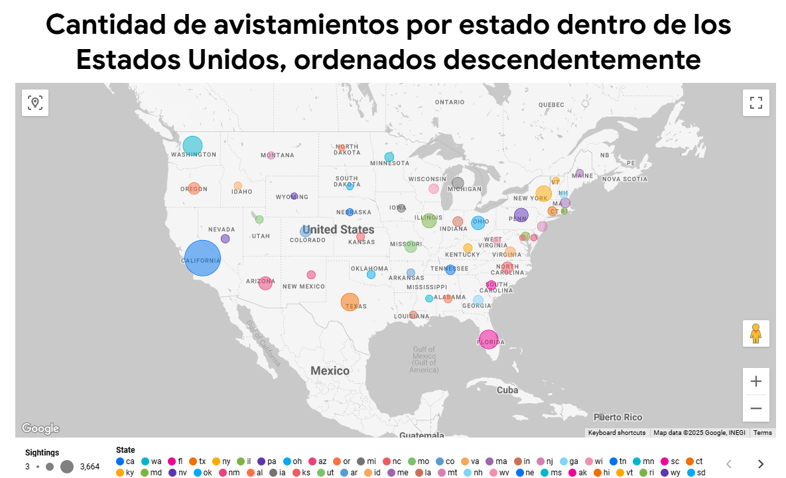

---

## Paso 16: Conclusiones

El flujo de trabajo completo permitió transformar datos en bruto en información valiosa mediante la carga, limpieza y análisis en Google Cloud Platform. Se recomienda profundizar en los análisis por año, tipo de avistamiento y contexto temporal para establecer correlaciones más robustas. Asimismo, mejorar la calidad del dataset y automatizar parte del pipeline aumentaría la eficiencia del proceso.
